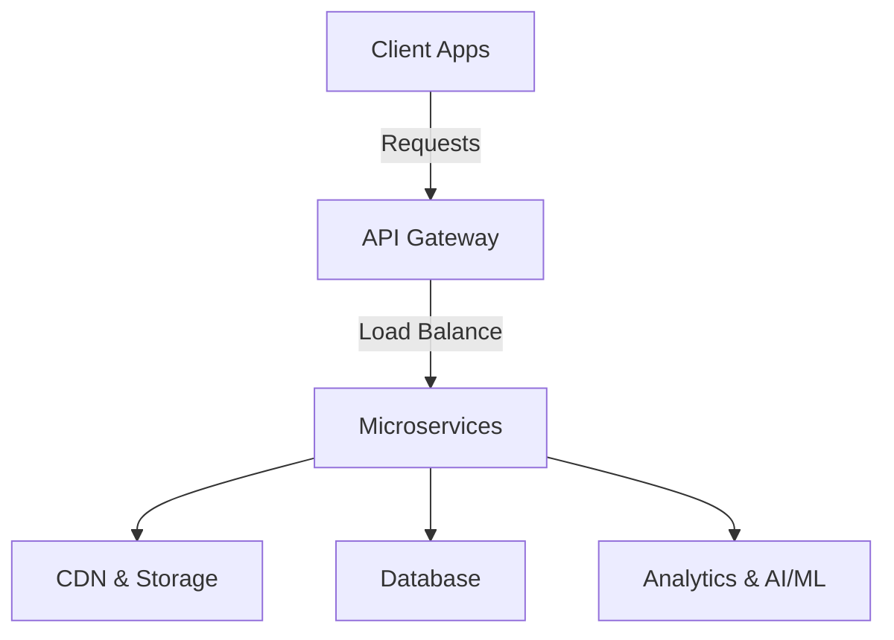

# Netflix System Design


## Overview
Netflix is a large-scale video streaming platform that delivers on-demand content to millions of users worldwide. The system must handle high availability, scalability, low latency, and fault tolerance while ensuring a seamless user experience.

## Architecture
Netflix follows a microservices-based architecture with cloud-native infrastructure. The key components include:

### 1. **Client Applications**
   - Web, Mobile (Android/iOS), Smart TVs, Gaming Consoles

### 2. **API Gateway**
   - Acts as an entry point for client requests.
   - Load balances requests to microservices.

### 3. **User Management Service**
   - Handles authentication, authorization, and user profiles.
   - Uses OAuth and JWT for secure access.

### 4. **Content Delivery Network (CDN)**
   - Caches and delivers videos from edge locations.
   - Netflix Open Connect helps reduce latency.

### 5. **Video Encoding and Storage**
   - Transcodes videos into multiple formats and bitrates.
   - Uses AWS S3 or Netflix’s own distributed storage.

### 6. **Recommendation System**
   - Uses Machine Learning algorithms for personalized recommendations.
   - Processes user watch history, ratings, and preferences.

### 7. **Playback Service**
   - Manages buffering, adaptive bitrate streaming, and error handling.
   - Uses DASH and HLS for smooth video streaming.

### 8. **Data Processing & Analytics**
   - Processes logs and analytics using Apache Kafka and Spark.
   - Monitors user engagement and optimizes content.

### 9. **Subscription & Billing Service**
   - Manages user subscriptions and payments.
   - Integrates with third-party payment providers.

### 10. **Monitoring & Logging**
   - Uses tools like Prometheus, Grafana, and ELK stack.
   - Ensures system health and detects anomalies.

## System Design Diagram


## Tech Stack
- **Frontend**: React, Swift, Kotlin
- **Backend**: Java, Spring Boot, Node.js
- **Database**: PostgreSQL, Cassandra, Redis
- **Streaming**: Apache Kafka, RabbitMQ
- **Cloud & Deployment**: AWS, Kubernetes, Docker
- **AI/ML**: TensorFlow, PyTorch

## Scalability Considerations
- **Load Balancing**: Use AWS ALB, Nginx, or Envoy.
- **Database Sharding**: To handle large datasets.
- **Cache Management**: Use Redis for frequently accessed data.
- **CDN Optimization**: Reduce latency and improve user experience.

## Docker Setup
```yaml
version: '3.8'
services:
  api-gateway:
    image: nginx:latest
    ports:
      - "8080:80"
    networks:
      - netflix-network

  user-service:
    build: ./user-service
    networks:
      - netflix-network

  recommendation-service:
    build: ./recommendation-service
    networks:
      - netflix-network

networks:
  netflix-network:
    driver: bridge
```

## Conclusion
Netflix's system is designed to be highly scalable, resilient, and efficient in delivering high-quality video content. By leveraging cloud computing, microservices, and AI-driven recommendations, Netflix continues to provide an exceptional user experience.

---

### Want to Contribute?
Feel free to raise an issue or submit a PR with suggestions to improve this documentation!
